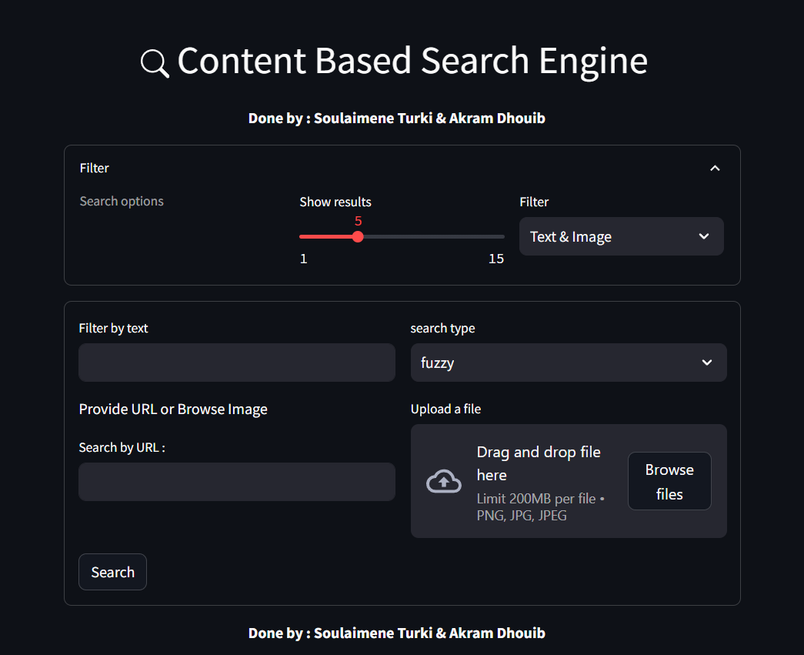

# Text-Image-based-search-engine# Image Search Engine

This is an image search engine that allows users to perform image-based, text-based, or combined searches.

## Overview

This search engine is built using a combination of FastAPI, Elasticsearch, and Streamlit, providing a powerful and user-friendly interface for searching and retrieving image results.

## Features

- **Image-Based Search:** Search for images that are visually similar to a given query image.
- **Text-Based Search:** Search for images based on text queries, such as keywords or descriptions.
- **Combined Search:** Perform searches that combine both image and text criteria.

## Technologies Used

- **FastAPI:** The backend of the application is built using FastAPI, which provides a robust and efficient API framework.
- **Elasticsearch:** Elasticsearch is used as the search engine to store and retrieve images and metadata.
- **Streamlit:** The frontend interface is developed with Streamlit, allowing users to interact with the search engine seamlessly.